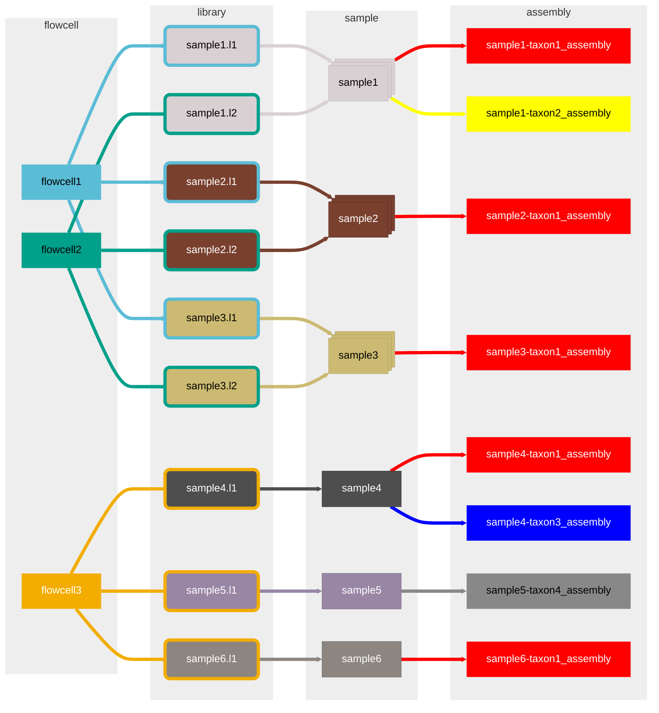

# Terra workspace initial setup

This is a walkthrough demonstrating initial set up of a workspace on the Terra cloud platform for viral sequencing work.

# Contents
{:.no_toc}

1. Table of Contents
{:toc}

## Terra documentation

In addition to the aspects of Terra described below, additional information concerning Terra can be found in the [official Terra documentation](https://support.terra.bio/hc/en-us/categories/360001399872).

Terra is tested using and intended to be accessed with the [Google Chrome browser](https://www.google.com/chrome/).

## Sign in to Terra 

1. Navigate to [https://app.terra.bio](https://app.terra.bio).
2. Click the icon in the upper left corner to expand the main menu.
3. Click "Sign In". A popup window will appear[^1]. 
4. Click "Sign in with Google", and authenticate using the credentials for your Google account.

<!--  -->

[^1]: Pop-up blocking may need to be disabled in your browser if the authentication pop-up window does not appear after clicking "Sign In"

## Create a new workspace

Next, a new workspace will be created. 
In Terra, a workspace is a way of grouping together tabular data, compute jobs, output data, and interactive notebooks. 
Workspaces are a good way to scope data by project, and each is associated with a billing project and a list of users or groups allowed to access the workspace data.

1. Navigate to view the list of workspaces you can access: [https://app.terra.bio/#workspaces](https://app.terra.bio/#workspaces).
2. Click the "+" icon<!--  --> to start configuring a new workspace.
3. Enter a unique workspace name, and optionally a description.
4. Select a billing project (`pathogen-genomic-surveillance`).
5. After selecting a billing project, a few more input fields will appear. Leave **Bucket location** set to its default value. **_DO NOT_** select "**Workspace will have protected data**". **_DO NOT_** select any value for the "**Authorization domain**"[^2].
6. Click "**Create workspace**"; you will be redirected to the main dashboard for the newly-created workspace.

[^2]: **_Do not_** select an **Authorization Domain**; doing so will complicate access and sharing of workspace data.

### Selecting Microsoft Azure as the cloud backend for a Terra workspace

Workspaces, their data, and stored output from compute jobs exist on either Google Compute Platform or Microsoft Azure. Each billing project is associated with a particular cloud backend. The cloud backend used for a workspace is specified based on the billing project selected when creating a new workspace, and it cannot be changed for an existing workspace. 

## Organizing data in Terra

Within a workspace, data are organized into files and tables. 

### File data

Each workspace created in Terra has its own cloud bucket[^3] for storing file data. Paths to these files can be stored in data tables and used as workflow inputs. File outputs from compute jobs are stored in the same workspace bucket.
Access to the file data of a workspace is controlled according to the sharing settings of the workspace as a while.

Compute jobs can also use data stored in external buckets, provided the user's [proxy account](https://support.terra.bio/hc/en-us/articles/360031023592) has read access to the data[^4].

Data can be transferred to or from a workspace bucket using a web browser, or from the command line via the `gsutil` or [`gcloud storage`](https://cloud.google.com/sdk/docs/install) CLI (Google Cloud Platform).

Upload the files provided to the workspace:
 - `reference_genomes/ref-RSVA-KY654518.1.fasta`
 - `reference_genomes/ref-RSVB-MZ516105.1.fasta`

[^3]: File data are stored in [_Blob Storage_](https://azure.microsoft.com/en-us/products/storage/blobs) on Microsoft Azure.
[^4]: The identifier for a user's proxy account—formatted as an e-mail address—can be found on the Terra [Profile Information page](https://app.terra.bio/#profile).

### Tabular data
There are two main types of table:
- _Workspace Data_: data that may be common across multiple compute jobs. It's a good place to store paths to reference genomes, databases, and re-used metadata or parameters.
- _Data Tables_: the main way to organize data at scale in Terra. Each table cell can contain text strings, numbers, boolean states (`true`/`false`), references to other table rows, or a list with multiple items of one of these types.
The values in the rows in these tables can be used as input for compute jobs, and also store the corresponding _output_ from the same compute jobs.
When a compute workflow is configured, it can use data from an individual table as input, and execute multiple jobs in parallel, one per row selected from the chosen table. 
When each job finishes, its output will be stored in columns of the same row that was used as input for the job.
Each workspace can have multiple tables, to aid organization, and also to describe _relationships_ between rows in different tables[^5].

A cell in one table can reference one or more rows in another table; for example, a table representing samples may list rows with sample names, and have a column that references one or more sequencing libraries for each sample, with the actual data for each sequencing library stored in a second table.

[^5]: Internally, Terra stores data in a relational database and conceptualizes one-to-one, one-to-many, and many-to-many relationships similarly.

#### Adding common Workspace Data

First, add few common fields to the Workspace Data table from the TSV file provided:
Navigate to the **Data** tab of the workspace, click **Workspace Data**, and then drag and drop onto the browser (_upload TSV_) the file `tabular_inputs/workspace-attributes.tsv`

**TO DO: screenshots and detailed description of how to fix the bugs with String Lists, specifically blastDbs, remove quotes and brackets but not commas, switch String to String List, verify it works by previewing the files and seeing a non-zero file size**

Copy the full bucket paths for the two reference genomes to the corresponding cells in the **Workspace Data** table:
 - `ref_RSV_A_fasta`: (path to: `ref-RSVA-KY654518.1.fasta` in workspace files)
 - `ref_RSV_B_fasta`: (path to: `reference_genomes/ref-RSVB-MZ516105.1.fasta` in workspace files)

#### Adding a table for sequencing runs

Add a table to store information for sequencing runs, where each row in the table will corresponds to an individual flowcell:
Navigate to the **Data** tab of the workspace, click **Import Data**, and then click **Upload TSV**. Drag and drop the file provided, `tabular_inputs/flowcell_data.tsv`, and click **Start Import Job**.

### Exporting tabular data

The content of Terra data tables can be exported to TSV files for viewing and manipulation in external tools. 
The same data can also be copied to the user's clipboard.

TSV data can also be imported to create a new data table or modify the values of an existing table, as shown above.

## Interactive Notebooks in Terra

Each workspace can have its own interactive [Jupyter notebooks](https://jupyter.org/).

The notebooks are stored as `*.ipynb` files within the `notebooks/` sub-path of a workspace file storage bucket, and can be moved or copied between workspaces as long as the `*.ipynb` files reside within `notebooks/`.

To create or use a notebook, a virtual compute instance containing Jupyter must be created or re-used.
These instances can be created or accessed via the **Analyses** tab of a Terra workspace.

### Upload the notebook

In the **Data** tab, click **Files** on the left-hand pane. If a folder called `notebooks/` does not exist, click **New folder** and create a folder called `notebooks`[^7].

Click the `notebooks/` folder to view the content.

Upload the `create_data_table_tsv.ipynb` file to `notebooks/`. The `*.ipynb` file will appear once fully uploaded.

[^7]: The **Analyses** tab only lists notebooks stored in the `notebooks/` folder; if the folder name does not match this exactly, the notebooks will not appear under **Analyses**.
